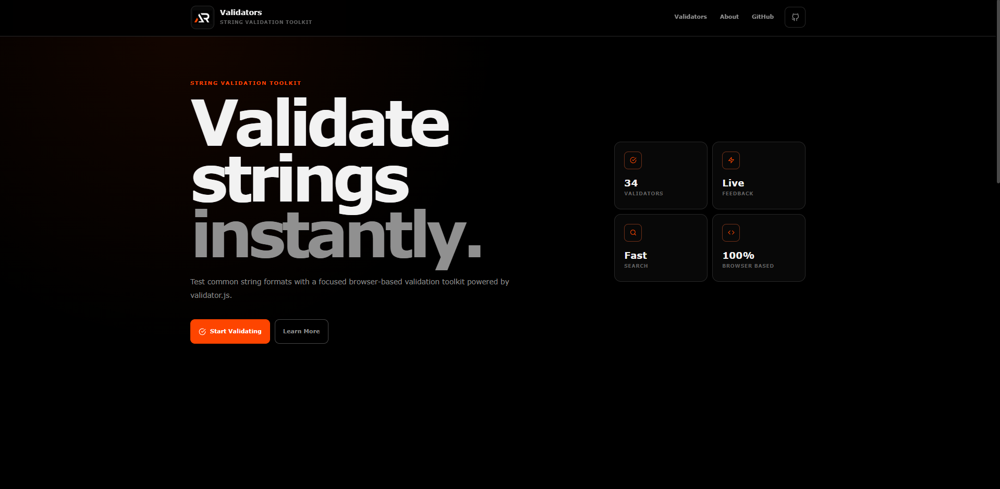

# Validators

A modern browser-based string validation toolkit built with React, Vite, and validator.js.

Validators provides a searchable collection of common validation utilities with instant feedback, practical examples, and a responsive interface.



## Live Demo

https://a2rp.github.io/validators/

## Features

- 34 string validators
- Searchable validator library
- Live validation feedback
- Neutral, valid, and invalid result states
- Ready-to-use examples
- Responsive desktop, tablet, and mobile layout
- Keyboard-friendly controls
- Accessible validation feedback
- Fixed responsive header
- Mobile navigation
- Back-to-top control
- Dark monochromatic interface
- Client-side validation with no backend required

## Validators

The toolkit includes validators for:

- Alpha and alphanumeric strings
- ASCII and Base32
- Credit cards and EAN codes
- Email addresses
- Floating-point numbers and integers
- Fully qualified domain names
- Freight container IDs
- Hexadecimal values and colors
- HSL and RGB colors
- IBAN and IMEI numbers
- IP and MAC addresses
- ISBN numbers
- JSON and JWT values
- Latitude and longitude coordinates
- MD5 hashes
- MIME types
- Mobile phone numbers
- Numeric and octal values
- Port numbers
- Slugs
- Strong passwords
- URLs
- UUIDs

## Tech Stack

- React
- Vite
- JavaScript
- SCSS Modules
- validator.js
- React Icons
- ESLint
- GitHub Pages

## Project Structure

```text
validators
├── public
│   ├── favicon.ico
│   ├── logo.png
│   └── preview.png
├── src
│   ├── components
│   │   ├── backToTop
│   │   ├── footer
│   │   ├── header
│   │   ├── validatorInput
│   │   ├── validatorList
│   │   ├── validatorResult
│   │   └── validatorTool
│   ├── data
│   │   └── validators.js
│   ├── utils
│   │   └── validateValue.js
│   ├── App.jsx
│   ├── App.module.scss
│   ├── index.css
│   └── main.jsx
├── eslint.config.js
├── index.html
├── LICENSE
├── package.json
├── README.md
└── vite.config.js
```

## Run Locally

Clone the repository and install the dependencies:

```bash
git clone https://github.com/a2rp/validators.git
cd validators
npm install
```

Start the development server:

```bash
npm run dev
```

Create a production build:

```bash
npm run build
```

Run lint checks:

```bash
npm run lint
```

## Deployment

The project is configured for GitHub Pages.

Deploy the production build with:

```bash
npm run deploy
```

## Accessibility

The interface includes semantic controls, keyboard navigation, visible focus states, accessible labels, responsive navigation, and live validation feedback using ARIA attributes.

## Future Prospects

Possible future additions include validator categories, validation options, input history, copied result feedback, and additional validator.js utilities.

## License

This project is licensed under the MIT License.

## Links

- Portfolio: https://www.ashishranjan.net
- GitHub: https://github.com/a2rp
- CodePen: https://codepen.io/ash1198
- LinkedIn: https://www.linkedin.com/in/aashishranjan
- Facebook: https://www.facebook.com/theash.ashish
- YouTube: https://www.youtube.com/channel/UCLHIBQeFQIxmRveVAjLvlbQ
- Email: mailto:ash.ranjan09@gmail.com

## Support

- Support: https://a2rp-donation-page.netlify.app/
- Buy Me a Coffee: https://buymeacoffee.com/a2rp
- Patreon: https://www.patreon.com/a2rp
